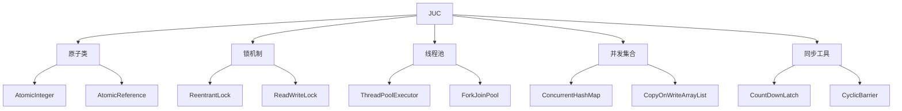
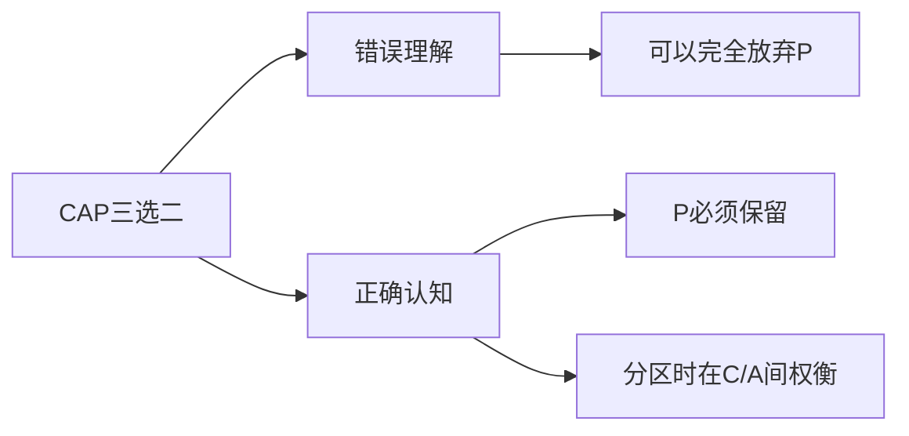

Java 对并发的支持被认为是其核心优势之一，相比许多其他编程语言，Java 提供了更丰富、更成熟的并发编程工具和特性。以下是 Java 在并发支持方面表现出色的主要原因：

---

### 1. **内置的线程支持**
Java 从语言层面提供了对多线程的支持，通过 `java.lang.Thread` 类和 `java.lang.Runnable` 接口，开发者可以轻松创建和管理线程。例如：
```java
Thread thread = new Thread(() -> System.out.println("Hello from a thread!"));
thread.start();
```
这种内置的线程支持使得 Java 在多线程编程方面非常直观和易用。

---

### 2. **丰富的并发工具库**
Java 提供了 `java.util.concurrent` 包，其中包含了大量高效、线程安全的并发工具类，例如：
- **线程池**（`ExecutorService`、`ThreadPoolExecutor`）：管理线程的生命周期，避免频繁创建和销毁线程的开销。
- **并发集合**（`ConcurrentHashMap`、`CopyOnWriteArrayList`）：提供了线程安全的集合类，避免手动同步。
- **同步工具**（`CountDownLatch`、`CyclicBarrier`、`Semaphore`）：用于协调多个线程的执行。
- **原子变量**（`AtomicInteger`、`AtomicReference`）：提供了无锁的线程安全操作。

这些工具大大简化了并发编程的复杂性，并提高了性能。

---

### 3. **内存模型（Java Memory Model, JMM）**
Java 定义了明确的内存模型（JMM），规范了多线程环境下变量的可见性和有序性。JMM 通过以下机制确保线程安全：
- **`volatile` 关键字**：确保变量的可见性，避免线程缓存不一致的问题。
- **`synchronized` 关键字**：提供互斥锁，确保同一时间只有一个线程访问共享资源。
- **`happens-before` 规则**：定义了操作之间的顺序关系，确保多线程环境下的正确性。

JMM 的设计使得开发者能够更清晰地理解多线程程序的行为，避免常见的并发问题（如竞态条件、死锁等）。

---

### 4. **锁机制与同步**
Java 提供了多种锁机制来支持并发编程：
- **内置锁（`synchronized`）**：简单易用，适用于大多数场景。
- **显式锁（`ReentrantLock`）**：提供了更灵活的锁控制，支持公平锁和非公平锁。
- **读写锁（`ReentrantReadWriteLock`）**：允许多个读线程同时访问，提高读多写少场景的性能。

这些锁机制为开发者提供了丰富的选择，可以根据具体需求选择最合适的同步方式。

---

### 5. **线程间通信**
Java 提供了多种线程间通信的机制：
- **`wait()`、`notify()`、`notifyAll()`**：用于实现线程间的等待和通知机制。
- **`BlockingQueue`**：提供了线程安全的队列，支持生产者-消费者模式。
- **`Future` 和 `CompletableFuture`**：用于异步编程，支持任务的链式调用和组合。

这些机制使得线程间的协作更加方便和高效。

---

### 6. **高性能的并发实现**
Java 的并发工具类（如 `ConcurrentHashMap`、`ThreadPoolExecutor`）经过高度优化，能够在高并发场景下提供优异的性能。例如：
- **`ConcurrentHashMap`**：通过分段锁（JDK 7）或 CAS 操作（JDK 8+）实现高效的并发访问。
- **`ForkJoinPool`**：支持分治算法的并行执行，适用于计算密集型任务。

---

### 7. **丰富的异步编程支持**
Java 8 引入了 `CompletableFuture`，提供了强大的异步编程支持。开发者可以通过链式调用组合多个异步任务，例如：
```java
CompletableFuture.supplyAsync(() -> fetchData())
                .thenApply(data -> processData(data))
                .thenAccept(result -> System.out.println(result));
```
这种编程模型使得异步代码更加简洁和易读。

---

### 8. **与其他语言的对比**
相比一些其他语言，Java 在并发支持方面的优势主要体现在：
- **C/C++**：需要手动管理线程和同步，缺乏高级并发工具。
- **Python**：由于 GIL（全局解释器锁）的存在，多线程性能受限。
- **JavaScript**：单线程模型，依赖事件循环和异步回调，缺乏真正的多线程支持。
- **Go**：虽然 Go 的 goroutine 和 channel 提供了强大的并发支持，但 Java 的并发工具库更加丰富和成熟。

---

### 9. **生态系统和社区支持**
Java 拥有庞大的生态系统和活跃的社区，许多开源框架（如 Spring、Akka、Netty）都提供了对并发的进一步支持。开发者可以轻松找到相关的工具、库和最佳实践。

---

### 总结
Java 对并发的支持之所以被认为更好，主要是因为：
1. 内置的线程支持和丰富的并发工具库。
2. 明确的内存模型和高效的同步机制。
3. 高性能的并发实现和强大的异步编程支持。
4. 庞大的生态系统和社区支持。

这些特性使得 Java 成为开发高并发应用的理想选择，尤其是在企业级应用和大规模系统中。


# 多线程与高并发知识体系总结

## 一、核心概念精要

### 1. 线程安全三大问题
| 问题类型   | 本质原因           | 解决方案                     |
| ---------- | ------------------ | ---------------------------- |
| **原子性** | 操作被线程切换打断 | synchronized、原子类、CAS    |
| **可见性** | CPU缓存不一致      | volatile、final、锁          |
| **有序性** | 指令重排序优化     | happens-before规则、内存屏障 |

### 2. 锁机制对比
| 锁类型            | 特点                      | 适用场景       |
| ----------------- | ------------------------- | -------------- |
| **synchronized**  | JVM内置、自动释放、非公平 | 简单临界区保护 |
| **ReentrantLock** | 可中断、可定时、公平可选  | 复杂同步需求   |
| **StampedLock**   | 乐观读、锁降级            | 读多写少场景   |

## 二、并发工具全景图

### 1. Java并发包核心组件


### 2. 线程池配置黄金法则
```java
ThreadPoolExecutor pool = new ThreadPoolExecutor(
    Runtime.getRuntime().availableProcessors(), // 核心线程数
    Runtime.getRuntime().availableProcessors() * 2, // 最大线程数
    60, TimeUnit.SECONDS,
    new ArrayBlockingQueue<>(200), // 有界队列
    new ThreadPoolExecutor.CallerRunsPolicy() // 拒绝策略
);
```

## 三、经典问题解决方案

### 1. 库存超卖问题
| 方案         | 实现方式          | 特点             |
| ------------ | ----------------- | ---------------- |
| **悲观锁**   | SELECT FOR UPDATE | 一致性高、性能差 |
| **乐观锁**   | 版本号机制        | 高并发、需重试   |
| **分布式锁** | Redis/Zookeeper   | 跨JVM可用        |
| **令牌桶**   | RateLimiter       | 平滑限流         |

### 2. 线程安全单例模式
```java
// 双重检查锁（JDK5+）
public class Singleton {
    private volatile static Singleton instance;
    
    public static Singleton getInstance() {
        if (instance == null) {
            synchronized (Singleton.class) {
                if (instance == null) {
                    instance = new Singleton();
                }
            }
        }
        return instance;
    }
}
```

## 四、性能优化关键点

### 1. 锁优化技巧
- **减小锁粒度**：ConcurrentHashMap分段锁
- **锁分离**：读写锁分离
- **无锁编程**：CAS原子操作
- **锁消除**：JVM逃逸分析

### 2. 并发性能指标
| 指标       | 健康值     | 监控工具                  |
| ---------- | ---------- | ------------------------- |
| 线程等待率 | <30%       | Arthas、JConsole          |
| 上下文切换 | <5000次/秒 | pidstat、vmstat           |
| 锁竞争时间 | <5ms       | JFR(Java Flight Recorder) |

## 五、分布式并发挑战

### 1. CAP理论实践
```java
// 分布式锁Redisson实现
RLock lock = redisson.getLock("stockLock");
try {
    lock.lock();
    // 业务逻辑
} finally {
    lock.unlock();
}
```

### 2. 秒杀架构设计
```
用户请求 → 限流层(Redis) → 队列削峰(Kafka) → 
库存预扣减(Redis Lua) → 订单创建(DB) → 
支付回调(异步通知)
```

## 六、学习路径建议

1. **基础阶段**：
   - 掌握JMM内存模型
   - 熟练使用synchronized/volatile
   - 理解happens-before规则

2. **进阶阶段**：
   - 深入AQS实现原理
   - 掌握并发设计模式
   - 学习无锁算法

3. **高手阶段**：
   - JVM层锁优化机制
   - 操作系统线程调度
   - 分布式一致性协议

## 七、必备工具清单

| 工具         | 用途       | 示例命令                   |
| ------------ | ---------- | -------------------------- |
| **jstack**   | 线程转储   | `jstack -l <pid>`          |
| **jconsole** | 可视化监控 | 直接运行                   |
| **Arthas**   | 在线诊断   | `watch com.demo.Service *` |
| **JMeter**   | 压力测试   | 创建200线程组              |

记住：并发编程没有银弹，理解原理比记住API更重要。建议通过"理论→实验→监控→优化"的循环持续精进。


# CAP理论深度解析与实践挑战

CAP理论看似简单，但在实际分布式系统设计中却充满精妙之处和权衡艺术。我将带您穿透表象，理解其本质复杂性。

## 一、CAP理论核心三要素

| 要素  | 完整名称                         | 通俗解释                     | 技术体现            |
| ----- | -------------------------------- | ---------------------------- | ------------------- |
| **C** | Consistency (一致性)             | 所有节点同一时刻看到相同数据 | 读写原子性、线性化  |
| **A** | Availability (可用性)            | 每个请求都能获得非错误响应   | 99.9% SLA、快速失败 |
| **P** | Partition tolerance (分区容错性) | 网络分区时系统仍能运行       | 心跳检测、自动恢复  |

## 二、为什么说"只能三选二"是误解？

### 真实情况：
1. **P是必选项**：分布式系统必须处理网络分区
2. **实际是C与A的权衡**：在分区发生时选择CP还是AP

### 经典误解澄清：


## 三、不同场景下的实践选择

### 1. CP系统 (优先一致性)
```java
// ZooKeeper伪代码
void updateData(String path, String newData) {
    lockGlobal(); // 全局锁保证一致性
    try {
        if (getQuorumApproval()) { // 需要多数节点确认
            applyUpdate(path, newData);
        } else {
            throw new PartitionException(); // 放弃可用性
        }
    } finally {
        unlockGlobal();
    }
}
```
**典型系统**：ZooKeeper、Etcd、HBase  
**代价**：分区时可能拒绝写入

### 2. AP系统 (优先可用性)
```java
// Cassandra伪代码
void writeData(String key, String value) {
    Node randomNode = pickRandomNode(); // 不要求全部可用
    try {
        randomNode.write(key, value); // 异步复制其他节点
        return SUCCESS; // 立即响应
    } catch (NetworkException e) {
        logConflict(key, value); // 记录冲突待后续解决
        return ACCEPTED; // 仍返回成功
    }
}
```
**典型系统**：Cassandra、DynamoDB、Eureka  
**代价**：可能读取到旧数据

## 四、现实中的复杂权衡

### 1. 时态维度
| 时间阶段   | 可能策略    | 示例               |
| ---------- | ----------- | ------------------ |
| 分区发生时 | 快速降级AP  | 电商允许查看旧库存 |
| 分区恢复时 | 渐进式恢复C | 合并冲突的购物车   |

### 2. 粒度控制
```java
// 微服务中混合策略
@Transactional(CP) 
void placeOrder() { /* 订单核心服务 */ }

@APICircuitBreaker(AP)
ProductInfo getProduct() { /* 商品查询服务 */ }
```

## 五、超越CAP的进阶认知

### 1. PACELC扩展理论
```
分区时(P) → 在A和C之间选择(A/C)
无分区时(E) → 在L(延迟)和C之间选择
```

### 2. 现代系统设计趋势
| 模式           | 描述                 | 案例              |
| -------------- | -------------------- | ----------------- |
| **CRDTs**      | 无冲突复制数据类型   | Riak、Automerge   |
| **CALM**       | 逻辑单调性保证一致性 | Amazon Aurora     |
| **可调一致性** | 按需设置一致性级别   | MongoDB、CosmosDB |

## 六、实践中的典型陷阱

### 1. 虚假的CP
```java
// 错误示范：误以为两节点就是CP
DB_Node1.write(data); 
DB_Node2.write(data); // 网络分区时可能失败
// 实际未达到多数派要求
```

### 2. 失控的AP
```python
# 没有冲突解决的AP系统
def update_user_profile(user_id, data):
    all_nodes = get_available_nodes() # 可能写入部分节点
    for node in all_nodes:
        try:
            node.async_update(data) # 异步更新
        except:
            pass # 静默忽略错误
    return "success" # 但数据可能不一致
```

## 七、CAP决策框架

1. **业务需求分析**：
   - 金融交易系统 → CP
   - 社交网络动态 → AP

2. **技术实现检查表**：
   - [ ] 是否实现真正多数派写入？
   - [ ] 冲突解决机制是否完备？
   - [ ] 客户端能否处理暂时不一致？

3. **监控指标**：
   ```bash
   # 一致性延迟监控示例
   curl http://db-node:8080/metrics | grep replication_lag
   ```

CAP理论看似简单的"三选二"，实则需要在不同服务、不同场景下做出精细权衡。理解这一点，才是真正掌握了分布式系统设计的精髓。建议通过搭建简单的Raft(CP)和Gossip(AP)协议实现来深化理解。